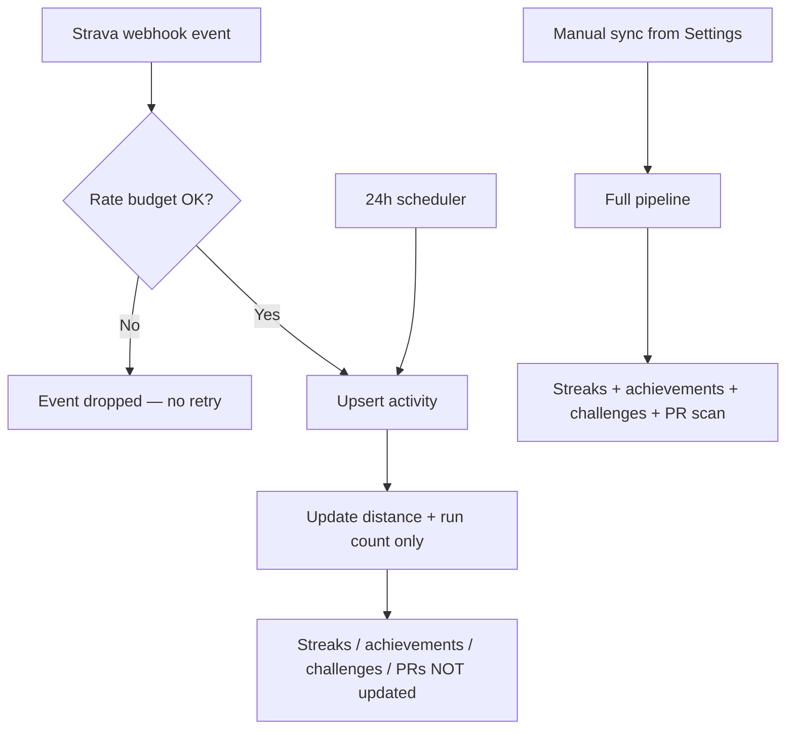

# Erode Runners Club — 2-Month Maintenance Audit

**Date:** July 6, 2026  
**Scope:** Backend, frontend, mobile (Capacitor), infrastructure/ops  
**Mode:** Read-only audit — no code changes made during this pass

This document is structured so Fable 5 (or any developer) can pick items and propose fixes. Each section includes severity, file paths, impact, and open product questions.

---

## Executive Summary

The app is feature-rich and mostly works in production, but there are **real bugs hiding behind “it works on my DB”**, **stale data paths**, and **ops drift** between repo config and what’s actually deployed.

Highest risk areas:

1. **Schema vs code mismatches** — `init.sql` doesn’t match several live routes (PRs, race results, password reset, group run caps).
2. **Broken frontend features** — Month comparison never renders; leaderboard “you” highlight never works.
3. **Strava sync pipeline split** — Webhooks update distance only; streaks/achievements/challenges/PRs only run on manual sync.
4. **Achievement math bug** — Distance achievements compare meters to km thresholds.
5. **No tests, no CI build, Docker runs dev mode** — regressions are easy to ship.

---

## Critical — Fix First

| ID | Problem | Where | Impact |
|----|---------|-------|--------|
| C1 | `password_reset_tokens` table used but **not in `init.sql`** | `server/src/routes/auth.ts`, `server/src/scheduler.ts` | Fresh DB deploy breaks forgot/reset password |
| C2 | **`personal_records` schema ≠ code** — DB has `distance_key`, `distance_meters`, `best_time_seconds`; code uses `category`, `distance`, `time_seconds`, `pace` | `server/db/init.sql` vs `server/src/routes/personal-records.ts` | PR scan/list/club board fail on clean DB |
| C3 | **`race_results` schema ≠ code** — code inserts `distance_category`, `pace`, `bib_number`; schema lacks them | `server/db/init.sql` vs `server/src/routes/race-results.ts` | Logging race results fails on clean DB |
| C4 | **Achievement distance units wrong** — compares Strava meters to seed values `5`, `10`, `50` (meant as km) | `server/src/routes/sync-strava.ts` + `server/db/init.sql` seeds | “First 5K” unlocks at ~5 meters; all distance badges broken |
| C5 | **Webhook POST unauthenticated** — fake `activity.delete` or `athlete.update` events can mutate data | `server/src/routes/webhook.ts` | Data loss / token wipe if URL is discovered |
| C6 | **Strava token encryption optional** — missing `TOKEN_ENCRYPTION_KEY` stores tokens plaintext | `server/src/utils/crypto.ts` | DB breach = live Strava access |
| C7 | **Expired JWT passes route guard but disables all data hooks** — `isAuthenticated()` checks token presence only; `getUser()` returns null on expiry; hooks use `enabled: !!user` | `src/integrations/supabase/client.ts`, `src/components/AuthRouter.tsx`, `src/hooks/useProfile.ts` | Blank home/stats while token looks “logged in” |
| C8 | **`MonthComparison` completely broken** — wrong destructuring `{ data: user }` from `useCurrentUser()`; still calls `supabase.from("activities")` which doesn’t exist | `src/components/stats/MonthComparison.tsx` | “vs Last Month” stat never shows |
| C9 | **Leaderboard self-highlight broken** — same `{ data: currentUser }` destructuring bug | `src/pages/Leaderboard.tsx` | User never sees their row highlighted |
| C10 | **API Docker image runs `tsx watch` (dev mode)** — no compiled `dist/`, source volume mounted | `server/Dockerfile`, `docker-compose.yml` | Not a real production deploy pattern |

---

## High — Backend

| ID | Problem | Where |
|----|---------|-------|
| H1 | Webhook + 24h scheduler only update distance/run counts — **no streaks, achievements, challenges, or PR scan** | `server/src/routes/webhook.ts`, `server/src/scheduler.ts` vs `server/src/routes/sync-strava.ts` |
| H2 | Webhook events **dropped on rate limit with no retry queue** | `server/src/routes/webhook.ts` |
| H3 | Admin checks use **JWT `role`**, not DB — demoted admins keep access until token expires | `server/src/routes/group-runs.ts`, `races.ts`, `blog.ts`, `training.ts` |
| H4 | Native OAuth **`/poll` returns tokens with no auth** — leaked/guessable `state` = account takeover | `server/src/routes/strava-auth.ts` |
| H5 | **Strava-only signup doesn’t generate `member_id`** | `server/src/routes/strava-auth.ts` native callback |
| H6 | Admin group runs reference **`max_participants`** column not in schema | `server/src/routes/admin.ts` vs `server/db/init.sql` |
| H7 | Default webhook verify token hardcoded: `eroderunners_webhook_2025` | `server/src/routes/webhook.ts` |
| H8 | **Draft content readable by UUID** — list filters `is_published`; detail endpoints don’t | `server/src/routes/challenges.ts`, `training.ts`, `group-runs.ts` |
| H9 | **`leaderboard_position` achievements seeded but never evaluated** | `server/db/init.sql` + `server/src/routes/sync-strava.ts` |
| H10 | Race registration doesn’t check `is_published` | `server/src/routes/races.ts` |
| H11 | Training “mark complete” doesn’t verify workout belongs to plan | `server/src/routes/training.ts` |
| H12 | Group run check-in has no RSVP/time/capacity rules | `server/src/routes/group-runs.ts` |

---

## High — Frontend

| ID | Problem | Where |
|----|---------|-------|
| F1 | **Query key mismatches** — admin invalidates wrong keys; member UI stays stale | See table below |
| F2 | **Settings Strava reconnect is web-only** — uses `window.location.href`, not native `Browser.open` + poll | `src/pages/Settings.tsx` vs `src/pages/ConnectStrava.tsx` |
| F3 | **Connect Strava logout** uses `setToken("")` instead of `clearToken()` | `src/pages/ConnectStrava.tsx` |
| F4 | **Strava callback doesn’t invalidate React Query cache** — stale empty home after connect | `src/pages/StravaCallback.tsx` |
| F5 | **Login has no link to Signup** — native users land on login with no signup path | `src/pages/Login.tsx` |
| F6 | **Admin panel flashes** before redirect for non-admins | `src/pages/Admin.tsx` |
| F7 | Session expiry uses hard `window.location.assign('/login')` without clearing query cache | `src/hooks/useAppLifecycle.ts` |

### Query Key Mismatches

| Admin / page invalidates | Hook actually uses | Broken feature |
|--------------------------|-------------------|----------------|
| `blog_posts` | `blog-posts` | Blog list after admin edit |
| `training_plans` | `training-plans` | Training list after admin edit |
| `userRank` (Leaderboard PTR) | `user-rank` | Pull-to-refresh rank on leaderboard |
| `["admin", "group-runs"]` only | `group-runs` | New group runs invisible to members |
| `["admin", "challenges"]` only | `challenges` | New challenges invisible to members |

---

## High — Infrastructure / Ops

| ID | Problem | Where |
|----|---------|-------|
| I1 | **No `.env.example`** — deploy depends on tribal knowledge | repo root + `server/` |
| I2 | **`VITE_SUPABASE_URL` must be set at build time** — not documented in runbook | build + `docs/PRODUCTION_RUNBOOK.md` |
| I3 | **Nginx path mismatch** — repo `nginx.conf` points to project `dist/`; runbook copies to `/var/www/erode-runners/dist/` | `nginx.conf` vs runbook |
| I4 | **APK download path incomplete in repo** — UI links to `/downloads/erc-latest.apk` but nginx block not in repo | `src/pages/Landing.tsx`, `src/pages/Settings.tsx` |
| I5 | **Domain strategy unclear** — CORS/Strava allow `app.*` and apex; repo nginx only has `api.*` | multiple files |
| I6 | **`APP_URL` default is apex** (`eroderunnersclub.com`) but live config uses `api.*` — reset emails may go wrong host | `server/src/routes/auth.ts` |
| I7 | **No tests, no CI build** — only Semgrep workflow | `.github/workflows/` |
| I8 | **Empty README** | `README.md` |
| I9 | Dead dependency `@supabase/supabase-js` still in `package.json` | root `package.json` |

---

## Medium — UX / Design / Flow

| ID | Problem | Where |
|----|---------|-------|
| D1 | **Inconsistent naming** — Bottom nav: “Dares”, “Profile”; pages say “Challenges”, “Settings” | `src/components/layout/BottomNav.tsx`, pages |
| D2 | **Stats disconnected state has no CTA button** — says connect Strava but no link | `src/pages/Stats.tsx` |
| D3 | **Member profile 404 sends to `/landing`** instead of `/home` for logged-in users | `src/pages/MemberProfile.tsx` |
| D4 | **Feature discoverability** — Blog, Achievements, Leaderboard, Group Runs, PRs only via Home quick links | IA overall |
| D5 | **Duplicate Group Runs entry** on Home (tile + quick link) | `src/pages/Home.tsx` |
| D6 | **“Avg Calories” label misleading** — all-time calories ÷ total runs, not monthly | `src/components/home/BentoStatsGrid.tsx` |
| D7 | **Offline = full-screen block** — no cached/read-only fallback | `src/components/OfflineScreen.tsx` |
| D8 | **Home tutorial** — no focus trap, `aria-modal`, or screen reader support | `src/pages/Home.tsx` |
| D9 | **Landing vs in-app visual systems diverge** — marketing `#050505` vs theme tokens | `src/pages/Landing.tsx` |
| D10 | **Undefined CSS classes** — `card-hover` used but only `glass-card-hover` exists; `gradient-gold` referenced but missing | `Challenges.tsx`, `Blog.tsx`, `OverviewTab.tsx`, `index.css` |
| D11 | **Dual toast systems** — shadcn `Toaster` + `Sonner` both mounted | `src/App.tsx` |
| D12 | **Typography inconsistent** — Login `text-5xl` vs Signup `text-3xl`; mixed uppercase/sentence case | auth pages |
| D13 | **Login keyboard dismiss on any touch** may fight input focus on iOS/Android | `src/pages/Login.tsx`, `src/pages/Signup.tsx` |
| D14 | **Avatar in Settings is URL text field** — no photo upload for non-technical users | `src/pages/Settings.tsx` |
| D15 | **Notification toggles in UI** — unclear if push is actually wired on mobile | `src/pages/Settings.tsx`, `server/src/routes/notifications.ts` |

---

## Medium — Missing Error States

Most list pages show loading + empty but **no error UI** — user sees infinite spinner or blank on API failure:

- `src/pages/Challenges.tsx`
- `src/pages/GroupRuns.tsx`
- `src/pages/Training.tsx`
- `src/pages/Blog.tsx`
- `src/pages/Races.tsx`
- `src/pages/Achievements.tsx`
- `src/pages/PersonalRecords.tsx`
- `src/pages/RaceResults.tsx`
- `src/pages/Home.tsx`
- `src/pages/Stats.tsx`

Good examples to copy: `src/pages/ChallengeDetail.tsx`, `src/pages/GroupRunDetail.tsx`, `src/pages/MemberProfile.tsx`

---

## Medium — Backend (Other)

| ID | Problem |
|----|---------|
| M1 | Weak password policy (min 6 chars only) |
| M2 | Change-password skips verification for Strava-only users (non-bcrypt hash) |
| M3 | Refresh tokens accumulate on every login (cleanup only on refresh) |
| M4 | Admin CRUD lacks input validation → generic 500s |
| M5 | No guard against removing last admin |
| M6 | Disconnect doesn’t revoke at Strava |
| M7 | In-memory state (rate limits, OAuth poll, webhook dedup) — breaks with multiple API instances or restarts |
| M8 | N+1 queries on races list and training plan detail |
| M9 | Scheduler comment says 6h; code runs 24h |
| M10 | Full sync caps at 2,000 activities (`page > 10`) |
| M11 | `signup` accepts `phone` but never stores it |
| M12 | `push_tokens` table exists; no push send implementation |
| M13 | Public `/api/members/:id` exposes running stats without auth (may be intentional for QR) |

---

## Low — Polish

- No global Express error handler (`server/src/index.ts`)
- `monthly_leaderboard.rank` column never updated
- Activities `limit` param unvalidated (`NaN` possible)
- Password visibility toggles lack `aria-label`
- Bottom nav inactive items icon-only, no labels for screen readers
- Clickable `div`s without keyboard support (`src/pages/Home.tsx`, `src/components/home/ActivityFeed.tsx`)
- Pull-to-refresh doesn’t await invalidation promises
- Capacitor config still has “replace with your domain” TODO comment
- Android `versionCode 1` — no release versioning process
- Unused import `isWeb` in `src/pages/Login.tsx`
- Share on member profile gives no clipboard feedback
- `useLeaderboard.ts` exports unused `useUserRankData`
- Settings fetches notifications but ignores loading/fetch errors
- `NotFound` logs to console only

---

## Accessibility Gaps (Cross-Cutting)

- Bottom nav: labels only visible when tab is active (`src/components/layout/BottomNav.tsx`)
- Header icon buttons missing `aria-label` (Settings gear, My Card on Home)
- Auth errors not announced with `role="alert"`
- Tutorial overlay not accessible (`src/pages/Home.tsx`)
- Safe area / home indicator clipping possible on some devices

---

## Strava Sync — How It Actually Works Today



**Open question:** Should webhook/scheduler run the same post-sync pipeline as manual sync?

---

## Rate Limiting Summary

| Layer | Coverage | Gap |
|-------|----------|-----|
| Express `generalLimiter` | 100 req/min/IP on all routes | Webhook bursts share same bucket |
| `authLimiter` | 10 req/min on `/api/auth`, refresh, strava-auth | — |
| Strava API budget | File-persisted in-memory | Not shared across instances; webhook drops when exhausted |
| `/webhook` POST | General IP limit only | No Strava source verification |
| `/poll`, `/callback` | General + auth limiter | Poll token theft risk remains |

---

## SQL Injection

**No clear SQL injection found.** Queries use parameterized `$1…$n` placeholders throughout.

---

## Open Questions for Fable 5

These need product decisions before implementation. Each includes enough context to propose a solution.

### Schema & Data

1. **Is production DB already migrated beyond `init.sql`?** If yes, `init.sql` needs to catch up OR become migration files. If no, PRs/race results/password reset are broken on fresh deploy.
2. **Achievement units:** Should `requirement_value` for distance be km (divide Strava meters by 1000) or should seed data use meters?
3. **`max_participants` on group runs:** Add column + enforce on RSVP, or remove from admin API?
4. **`push_tokens` table:** Build push notifications or remove dead schema?

### Auth & Security

5. **Webhook trust model:** Accept Strava’s lack of POST signing and mitigate via secret URL/network ACL, or add reconciliation queue?
6. **Native OAuth poll flow:** Should poll require server-issued session nonce / PKCE instead of bare `state`?
7. **Strava-only users:** Auto-generate `ERC-XXXX` member IDs like email signup?
8. **Password policy:** What minimum for a running club app? How do Strava-only users set/change passwords?
9. **`TOKEN_ENCRYPTION_KEY`:** Fail startup if missing in production?
10. **JWT role vs DB role:** Always check DB for admin actions, or shorten JWT expiry for admins?

### Product / UX

11. **Strava optional or required?** Skip exists; Home nags unconnected users. Is no-Strava a supported long-term state?
12. **Native onboarding:** Web gets `/landing`; APK users get `/login`. Should native see landing or a slim onboarding?
13. **Terminology:** Standardize “Dares” vs “Challenges”, “Profile” vs “Settings”?
14. **Bottom nav IA:** Add Leaderboard/Blog/Achievements to nav, or keep as secondary quick links?
15. **Public member profiles (`/m/:memberId`):** Full stats for anyone with QR link, or gated teaser?
16. **Offline strategy:** Full block vs show last cached Home/Stats data?
17. **Post-Strava sync UX:** Auto-invalidate queries + “sync complete” state on Home?
18. **Tutorial:** First visit only, or replay after major releases?
19. **Avatar:** Keep URL field or add image upload?
20. **Notification toggles:** What channels actually work today — email only, in-app, push?

### Infrastructure

21. **Canonical public URL:** Single origin on `api.*` for web+API+mobile OTA, or live split with `app.*` for frontend?
22. **Which `dist` path is live?** `/home/aditya/strava-runners-connect/dist` vs `/var/www/erode-runners/dist`?
23. **APK publish process:** Where does `erc-latest.apk` live, who updates it, symlink strategy?
24. **Is API actually running via Docker `tsx watch` or something else (systemd/pm2)?**
25. **`APP_URL` for emails:** Apex `eroderunnersclub.com` or `api.*` or `app.*`?
26. **SMTP long-term:** Gmail app password or transactional provider (Resend/SES)?
27. **Backup cron:** Is `scripts/backup-db.sh` on a 03:00 cron?
28. **Strava app settings:** Which callback domain is registered — `api.*` only?
29. **CI minimum bar:** lint + tsc + vite build + server tsc on every PR?
30. **Multi-instance:** Single server assumed forever, or need Redis for rate limits/OAuth state?

### Admin & Content

31. **Draft content by UUID:** Hide unpublished challenges/plans/group runs from non-admin detail views?
32. **Admin member lookup:** Should check-in expose member email to admins?
33. **Disconnect Strava:** Call Strava deauthorize API or local-only clear?
34. **Admin publish flow:** Should every admin save immediately invalidate member-facing caches?

### Mobile

35. **Capacitor OTA vs bundled web:** Keep loading remote `api.*` URL, or ship web assets in APK for offline shell?
36. **Password reset on mobile:** Does reset email deep-link into app or mobile browser?
37. **iOS TestFlight vs APK:** Is TestFlight the only iOS path indefinitely?
38. **Push notifications v1 scope:** FCM/APNs credentials, `google-services.json`, backend send logic — in or out?

### Additional (from audit gaps)

39. **Secrets management:** Stay on flat `.env` files on the host, or move to Docker secrets / a vault (e.g. host env only, 1Password, Doppler)?
40. **`leaderboard_position` achievements:** Implement Top 10 / Podium / Champion logic, or remove those rows from the achievements seed?
41. **`phone` on signup:** Build phone storage + verification, or remove the unused field from the signup API/UI?
42. **Env var naming cleanup:** Keep legacy names (`VITE_SUPABASE_URL`, unused `FRONTEND_URL`) or rename to something accurate (`VITE_API_URL`, `APP_URL` only)?
43. **Apex domain `eroderunnersclub.com`:** Dedicated marketing site, redirect to `app.*`, or leave unused? (Membership card QR links currently point at apex `/m/...`.)
44. **Club Activity Feed:** Keep removed from Home, surface elsewhere (e.g. Stats or its own tab), or delete the feature/API entirely?
45. **DB migration strategy:** Rely on `init.sql` only, or add numbered migration files and a migration runner for prod changes?
46. **Semgrep-only CI:** Keep security scan as-is, or expand GitHub Actions to lint + typecheck + build on every PR (and when should Semgrep run)?

---

## Suggested Maintenance Batches

### Batch 1 — “Things that are silently broken” (1–2 days)

- Fix `useCurrentUser()` destructuring in Leaderboard + MonthComparison
- Migrate MonthComparison to `api.get` pattern
- Fix achievement distance unit math
- Align `init.sql` with live route code (PRs, race results, password reset, max_participants)
- Fix query key mismatches (blog, training, group-runs, challenges, user-rank)
- Auth guard: await refresh or gate on valid `getUser()`

### Batch 2 — “Data correctness” (2–3 days)

- Unify post-sync pipeline (webhook + scheduler + manual)
- Webhook retry/queue or reconciliation on rate limit drop
- Generate `member_id` for Strava-only signups
- Hide draft content on detail endpoints
- Enforce group run check-in rules (RSVP, date window)

### Batch 3 — “Mobile & session polish” (1–2 days)

- Native Strava reconnect in Settings
- `clearToken()` everywhere; invalidate cache on Strava callback
- Login ↔ Signup cross-links
- iOS keyboard / Android autofill refinements (form `autoComplete`, avoid root `onTouchStart` blur)

### Batch 4 — “Ops hardening” (1–2 days)

- Production Dockerfile (`tsc` + `node dist/`)
- `.env.example` + runbook updates (build-time env, APK publish, deploy path)
- Align nginx.conf with live server
- CI: lint + typecheck + build
- Enforce `TOKEN_ENCRYPTION_KEY` in prod

### Batch 5 — “UX & design consistency” (2–3 days)

- Error states on all list pages
- Fix undefined CSS (`card-hover`, `gradient-gold`)
- Naming/IA pass (Dares vs Challenges, nav labels)
- Stats disconnected CTA
- Accessibility pass (bottom nav, clickable cards, tutorial)
- Remove dead `@supabase/supabase-js` dep; fill README

---

## What’s Actually Fine

- Parameterized SQL throughout — no obvious injection
- `requireAdmin` middleware checks DB for admin routes
- Rate limiting on auth endpoints
- SPA cache headers (no-store on `index.html`, long cache on hashed assets)
- Member ID / QR / public profile concept is solid
- First-time tutorial, empty states, signup-before-download gate are good UX additions
- CORS already includes `app.eroderunnersclub.com` (once backend is redeployed)

---

## Handoff Note for Fable 5

When proposing fixes, **verify production DB schema first**:

```sql
\d personal_records
\d race_results
\d password_reset_tokens
```

Several bugs may not show in prod if the DB was manually patched but `init.sql` was never updated — that’s its own problem for the next fresh deploy or clone.

---

## Related Docs

- [Production Runbook](./PRODUCTION_RUNBOOK.md)
- [Self-Hosting Migration](./SELF_HOSTING_MIGRATION.md) (partially stale — see infra findings above)
